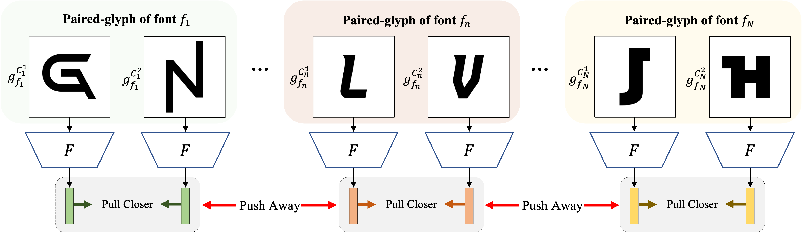
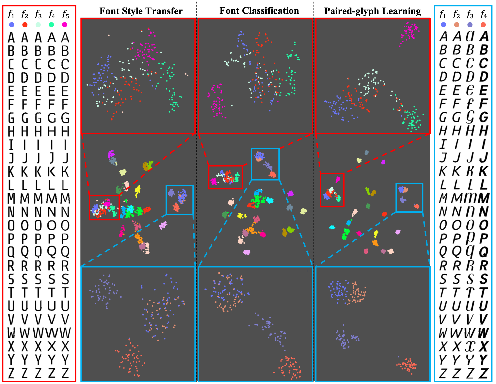

Font Representation Learning via Paired-glyph Matching
==================================================

**Accepted to **BMVC2022** :tada:**

PyTorch code of [Font Representation Learning via Paired-glyph Matching](https://arxiv.org/abs/2211.10967)

[Junho Cho](https://sudormrf.run/junhocho/), Kyuewang Lee, Jin Young Choi






## Installation

1. Clone this repository and makedir.

```
git clone https://github.com/junhocho/paired-glyph-matching.git
mkdir data
mkdir experiments
```

2. Use docker:

Check prerequiites inside docker: `junhocho/font-embedding:1` or refer to [Attr2Font](https://github.com/hologerry/Attr2Font).

```
docker run -it --rm --shm-size 100G --gpus all -v $PWD:/home -v $PWD/data:/home/data -v $PWD/experiments:/home/experiments  junhocho/font-embedding:1 bash
```

It mounts `$PWD` which is main code dir as home folder in the docker image, as well as `data` and `experiments` dirs.

3. Prepare dataset in `./data/`.

- Download O'Donovan dataset from [Attr2Font](https://github.com/hologerry/Attr2Font) as `./data/explor_all`.
  - `cp ./attributes_alphanumeric.txt ./data/explor_all`
- Download [OFL dataset](https://drive.google.com/file/d/1ErYQM5XTguNLH5fdkxv0ANYR30xk-xOt/view?usp=share_link) as `./data/ofl_images`.
  - Also download [glyph_files.txt](https://drive.google.com/file/d/1ZDywvYW5Hwo1n5S8uIyH6wvg_Zeb52rz/view?usp=share_link) and place in `./data/ofl_images/`

4. Train 

```bash
CUDA_VISIBLE_DEVICES=0 python main.py --phase train-representation \
	--experiment_name rep-paired_glyph_matching-ofl --dataset_name ofl \
	--n_epochs 50000 --check_freq 100 --lr 0.0002 \
	--backbone ResNet18  --feat_dim 1024 \
	--heads 70 --simclr --temperature 0.1
```

Check `./train_reproduce.sh` for more models.


4. Trained results are in `./experiments`


## Reproduce

This code can reproduce performance in the paper in GTX 1080ti.


### O'Donovan dataset

```bash
## Paired-glyph matching + Attr
## epoch 3900, 89.91
CUDA_VISIBLE_DEVICES=0 python main.py --phase train-representation \
	--experiment_name rep-paired_glyph_matching+attr --dataset_name donovan_embedding \
	--n_epochs 50000 --check_freq 100 --lr 0.0002 \
	--backbone ResNet18  --feat_dim 512 \
	--heads 70 --simclr --temperature 0.2 --train_attr  
```

```bash
## Paired-glyph matching
## epoch 7000, 89.60
CUDA_VISIBLE_DEVICES=0 python main.py --phase train-representation \
	--experiment_name rep-paired_glyph_matching --dataset_name donovan_embedding \
	--n_epochs 50000 --check_freq 100 --lr 0.0002 \
	--backbone ResNet18  --feat_dim 512 \
	--heads 70 --simclr --temperature 0.2 
```

```bash
## Classifier
## epoch 800,  83.90
CUDA_VISIBLE_DEVICES=0 python main.py --phase train-representation --experiment_name rep-font-cls \
	--dataset_name donovan_embedding --data_type 1glyph \
	--n_epochs 50000 --check_freq 100  --lr 0.0002 --backbone ResNet18 --train_fontcls 
```

```bash
## Style transfer
## epoch 4100, 71.84
CUDA_VISIBLE_DEVICES=0 python main.py --phase train-representation --experiment_name rep-styletransfer \
	--dataset_name donovan_embedding --data_type 2glyphs \
	--n_epochs 50000 --check_freq 100  --check_L1_gen_freq 500 --lr 0.0002 \
	--backbone ResNet18 --feat_dim 512 \
	--init_epoch 10900 --train_cae  --no_augmentation 
```

```bash
## Autoencoder
## epoch 28300, 27.125
CUDA_VISIBLE_DEVICES=0 python main.py --phase train-representation --experiment_name rep-glyph-autoencoder \
	--dataset_name donovan_embedding --data_type 1glyph \
	--n_epochs 50000 --check_freq 100  --lr 0.0002 --backbone ResNet18 --train_ae 
```

### OFL dataset

```bash
## Paired-glyph matching
## epoch 19400, 91.822
CUDA_VISIBLE_DEVICES=0 python main.py --phase train-representation \
	--experiment_name rep-paired_glyph_matching-ofl --dataset_name ofl \
	--n_epochs 50000 --check_freq 100 --lr 0.0002 \
	--backbone ResNet18  --feat_dim 1024 \
	--heads 70 --simclr --temperature 0.1 
```

```bash
## Classifier
## epoch 1600, 83.67
CUDA_VISIBLE_DEVICES=0 python main.py --phase train-representation --experiment_name font-cls-ofl-NoAug-lr1e-5 \
	--dataset_name ofl --data_type 1glyph \
	--n_epochs 50000 --check_freq 100  --lr 0.00001 --backbone ResNet34 \
	--backbone ResNet18  --feat_dim 512 \
	--train_fontcls --no_augmentation 
```

```bash
## Style transfer
## epoch 23300, 82.239
CUDA_VISIBLE_DEVICES=0 python main.py --phase train-representation --experiment_name cae-NoAug-ofl-dim1024 \
	--dataset_name ofl --data_type 2glyphs \
	--n_epochs 50000 --check_freq 100  --lr 0.0002 \
	--backbone ResNet18 --feat_dim 1024 \
	--train_cae --no_augmentation 
```

```bash
## Autoencoder
## epoch 7500, 15.551
CUDA_VISIBLE_DEVICES=0 python main.py --phase train-representation --experiment_name glyph-autoencoder-NoAug-ofl \
	--dataset_name ofl --data_type 1glyph \
	--n_epochs 50000 --check_freq 100  --lr 0.0002 \
	--backbone ResNet18 --train_ae  --no_augmentation 
```

## Acknowledgement


This repo is inspired by [Attr2Font](https://github.com/hologerry/Attr2Font).
Also some codes from

- [NT_Xent](https://github.com/Spijkervet/SimCLR/blob/master/simclr/modules/nt_xent.py)
- [PICA: PartItion Confidence mAximisation](https://github.com/Raymond-sci/PICA)


## Citation

```
@InProceedings{Cho2022,
	title = {Font Representation Learning via Paired-glyph Matching},
	author = {Cho, Junho and Lee, Kyuewang and Choi, Jin Young},
	booktitle = {British Machine Vision Conference (BMVC)},
	year = {2022}                         
}
```

## Copyright

The code and dataset are only allowed for PERSONAL and ACADEMIC usage.
